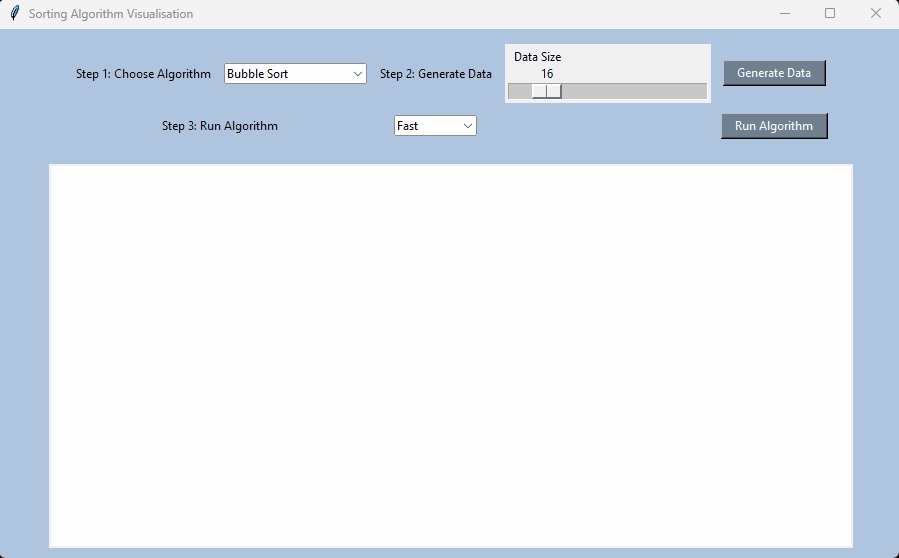

# Sorting Algorithm Visualizer

## Introduction

Sorting Algorithm Visualizer is a Python-based project that allows you to observe and understand how various sorting algorithms function. Sorting algorithms are essential in programming as they help reorganize data efficiently, whether it's sorting items alphabetically, by value, or length. This project aims to make sorting large lists more accessible and faster through computer program implementations of these algorithms.

## Supported Sorting Algorithms

### Bubble Sort
Bubble Sort, also known as sinking sort, is a straightforward sorting algorithm that repeatedly traverses the list to sort it. It compares each adjacent pair of items and swaps them if they are in the wrong order. The process continues until the list is fully sorted.

While simple, Bubble Sort is not practical for most problems, especially when compared to Python's built-in sort() function. However, it can be useful when dealing with mostly sorted input or small datasets.

**Time/Space Complexity Analysis**:

|Worst Case|Average Case|Best Case|In-place?|
|---|---|---|---|
|O(n2)|Θ(n2)|Ω(n)|Yes|

_In-place means that the algorithm manipulates the input list without using extra space, but it may require a small, non-constant extra space for its operation._

### Merge Sort
Merge Sort is a faster and more efficient algorithm compared to Bubble Sort. It follows a divide and conquer approach:

1. Divide the unsorted list into n sub-lists, each containing one element (a list of one element is considered sorted).
2. Repeatedly merge the sub-lists to produce new sorted sub-lists until only one sub-list remains. This final sub-list will be the sorted list.

**Time/Space Complexity Analysis**:

|Worst Case|Average Case|Best Case|In-place?|
|---|---|---|---|
|O(n log(n))|Θ(n log(n))|Ω(n log(n))|No|

### Quick Sort
Quick Sort is an efficient sorting algorithm and can be about two or three times faster than other competitors like merge sort and heapsort, **when implemented well**. It is a comparison sort, which means it can sort items of any type as long as a "less-than" relation (a total order) is defined for them.

**Time/Space Complexity Analysis**:

|Worst Case|Average Case|Best Case|In-Place?|
|---|---|---|---|
|O(n2)|Θ(n log(n))|Ω(n log(n))|Yes|

## How to Run the App

To run this app on your computer, follow these steps:

1. Download the following files: UI, BubbleSort, MergeSort, QuickSort.
2. Place all downloaded files in the same folder.
3. Run the "UI" file, which will launch the sorting algorithm visualizer app.

## Time Complexity Graphs

## Updates

- Improved the user interface for a more professional look and better user experience.
- Added step-by-step instructions to guide users through the process of choosing an algorithm, generating data, and running the algorithm.
- Implemented the option to select different speed settings for sorting animation.
- Removed the settings icon and made the UI cleaner and more focused on the sorting visualization.

## Future Updates
- Will fix freezing issues during the sorting process by running the algorithm with a slight delay using the `after()` method.

Feel free to explore the project, visualize different sorting algorithms, and deepen your understanding of how they work!
